## Outline

::: {.incremental}
- Memory systems hierarchy and characteristics
- Byte storage methods and memory cell concepts
- Design of scalable memory using RAM/ROM chips
- Construction of larger size memories
- **Memory interleaving**
- Memory interface address map
- Cache memory: principles and management techniques
- Types of caches, cache misses, mean access time evaluation
:::

::: {.notes}
This module explores the hierarchical memory organization, from registers to main memory and cache. Students learn to design memory systems using RAM and ROM chips, understand memory interleaving for performance, and study cache memory mapping techniques and replacement algorithms.
:::

# Memory Systems Hierarchy

## Memory Unit

::: {.incremental}
- Memory unit is an essential component of a digital computer — needed for storing programs and data
- Memory that communicates directly with the CPU is called **main memory**
- Only programs and data currently needed by the processor reside in main memory
- Devices that provide backup storage are called **auxiliary (secondary) memory**
- All other information is stored in auxiliary memory and transferred to main memory when needed
:::

## Memory Hierarchy

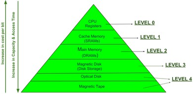{fig-align="center" width="85%"}

::: {.notes}
The memory hierarchy is a pyramid — registers at the top (fastest, smallest, most expensive per bit), then cache, main memory, and secondary storage at the bottom (slowest, largest, cheapest per bit). The goal is to give the illusion of a large, fast memory at low cost.
:::

## Memory Characteristics

| Characteristic | Options |
|---|---|
| **Location** | CPU / Internal (main) / External (secondary) |
| **Capacity** | Word size (bytes) / Number of words (blocks) |
| **Unit of transfer** | Word / Block |
| **Access methods** | Sequential / Direct / Random / Associative |
| **Performance** | Access time / Cycle time / Transfer rate |
| **Physical type** | Semiconductor / Magnetic / Optical |
| **Volatility** | Volatile / Non-volatile |

## Access Methods

::: {.incremental}
- **Sequential access** — access in predetermined linear sequence (e.g., magnetic tape)
- **Random access** — any location accessed directly, independent of physical location (e.g., RAM, ROM)
- **Direct access** — combination of sequential and random; general access to vicinity, then sequential search (e.g., hard disk)
- **Associative access** — word retrieved based on portion of its contents, not address (e.g., cache)
:::

## Performance Parameters

::: {.definition}
**Access Time.** Time from the instant an address is presented to memory until data is stored or made available for use.
:::

::: {.definition}
**Memory Cycle Time.** Access time + time required before a second access can commence.
:::

::: {.definition}
**Transfer Rate.** Rate at which data can be transferred into or out of memory. For random access: $\frac{1}{\text{cycle time}}$. For non-random: $T_n = T_a + \frac{N}{R}$
:::

## Performance Parameters — Summary

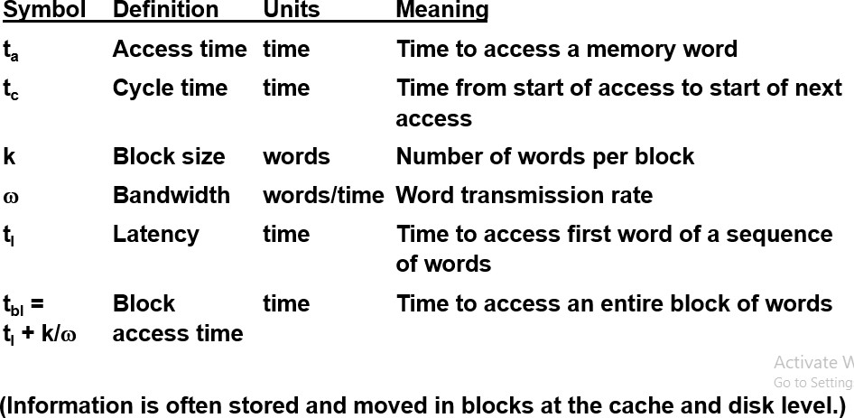{fig-align="center" width="85%"}

# Byte Storage Methods

## Big Endian vs. Little Endian

- **MSB** (Most Significant Byte) — left-most byte, carries greatest numerical value
- **LSB** (Least Significant Byte) — right-most byte, least effect on value

. . .

- **Big Endian** — MSB placed at the byte with the **lowest address** (first byte stored first)
- **Little Endian** — LSB placed at the byte with the **lowest address** (last byte stored first)

## Byte Storage — Visual

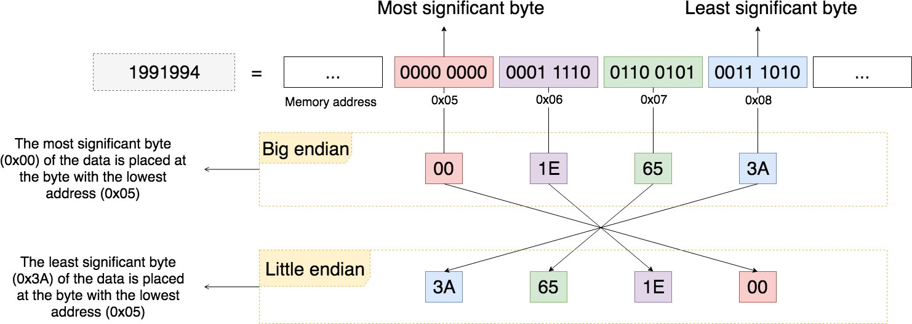{fig-align="center" width="85%"}

## Example: `0xDEADBEEF`

:::: {.columns}
::: {.column width="50%"}
### Big Endian

| Address | Value |
|---|---|
| Base + 0 | `DE` |
| Base + 1 | `AD` |
| Base + 2 | `BE` |
| Base + 3 | `EF` |
:::

::: {.column width="50%"}
### Little Endian

| Address | Value |
|---|---|
| Base + 0 | `EF` |
| Base + 1 | `BE` |
| Base + 2 | `AD` |
| Base + 3 | `DE` |
:::
::::

## Endianness in Practice

| Endianness | Architectures |
|---|---|
| **Little Endian** | Intel x86, DEC (PDP-11, VAX, Alpha) |
| **Big Endian** | Sun SPARC, IBM 360/370, Motorola 68000/88000 |
| **Bi-Endian** | PowerPC, MIPS, Intel IA-64 |

::: {.notes}
Big Endian is the most common format in data networking — TCP, UDP, IPv4, and IPv6 all use big endian order to transmit data. Little Endian is dominant on microprocessors (Intel x86).
:::

# Memory Organization

## Memory Cell and Organization

::: {.incremental}
- Basic element = **memory cell**
- Properties: exhibits two stable states (binary 1 and 0), can be written into, can be read
- Physical arrangement of bits to form words
- Two types of organization:
  - **1-dimensional** — linear arrangement
  - **2-dimensional** — matrix arrangement (row × column)
:::

# Design of Scalable Memory

## RAM Chip Structure

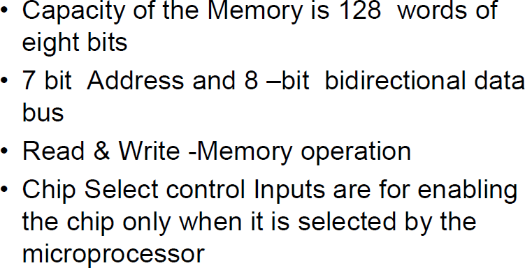{fig-align="center" width="85%"}

::: {.incremental}
- **Address bus** — specifies the row (word) to access
- **Data bus** — bidirectional, carries data in/out
- **Chip Select (CS)** — enables the chip when active
- **Read/Write (R/W)** — controls operation mode
- **High impedance state** — output disconnected from bus when chip is not selected
:::

::: {.notes}
For a 128 × 8 RAM chip: 7 address lines ($2^7 = 128$ words), 8 data lines. The chip operates only when CS1 = 1 and CS2 = 0. When not enabled, data bus is in high-impedance state.
:::

## ROM Chip Structure

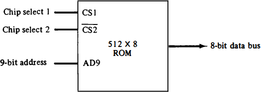{fig-align="center" width="85%"}

::: {.incremental}
- Organized externally similar to RAM, but data bus is **output only**
- No R/W signal needed — read-only by design
- ROM chips pack more bits per chip than RAM (cells occupy less space)
- Example: 512 × 8 ROM chip needs 9 address lines ($2^9 = 512$)
:::

## Construction of Larger Memories

Three cases for building $N' \times W'$ memory from $N \times W$ chips:

| Case | Condition | Strategy |
|---|---|---|
| 1 | $N' = N$, $W' > W$ | Increase word size (add columns) |
| 2 | $N' > N$, $W' = W$ | Increase number of words (add rows) |
| 3 | $N' > N$, $W' > W$ | Increase both rows and columns |

. . .

$$\text{Number of chips} = p \times q, \quad p = \frac{N'}{N}, \quad q = \frac{W'}{W}$$

# Memory Interleaving

## Motivation

::: {.incremental}
- Main memory is structured as a collection of **physically separate modules**
- Each module has its own **Address Buffer Register (ABR)** and **Data Buffer Register (DBR)**
- Memory access operations may proceed in **more than one module at the same time**
- The aggregate rate of transmission of words to and from memory can be **increased**
:::

::: {.notes}
The key insight is that main memory is relatively slower than the cache. By organizing memory into independent modules that can be accessed concurrently, we can hide the latency of individual memory accesses and increase effective bandwidth.
:::

## What is Memory Interleaving?

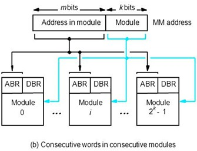{fig-align="center" width="85%"}

## Memory Interleaving — Definition

::: {.definition}
**Memory Interleaving.** An abstraction technique designed to compensate for slow main memory by spreading memory addresses evenly across memory banks.
:::

::: {.incremental}
- Divides memory into a number of **modules** such that **successive words** in the address space are placed in **different modules**
- To implement an interleaved structure, there must be $2^k$ modules (where $k$ bits of the address are used for module selection — **high-order** or **low-order** bits depending on the scheme)
- Main memory is **relatively slower** than cache — interleaving improves the **effective access time**
- Particularly useful when transferring a **block of data** to cache
:::

::: {.theorem}
**Key Principle.** With $M$-way interleaving, effective access time for sequential access $\approx \frac{\text{cycle time}}{M}$, reducing access time by a factor close to the number of memory banks.
:::

## High-Order Interleaving

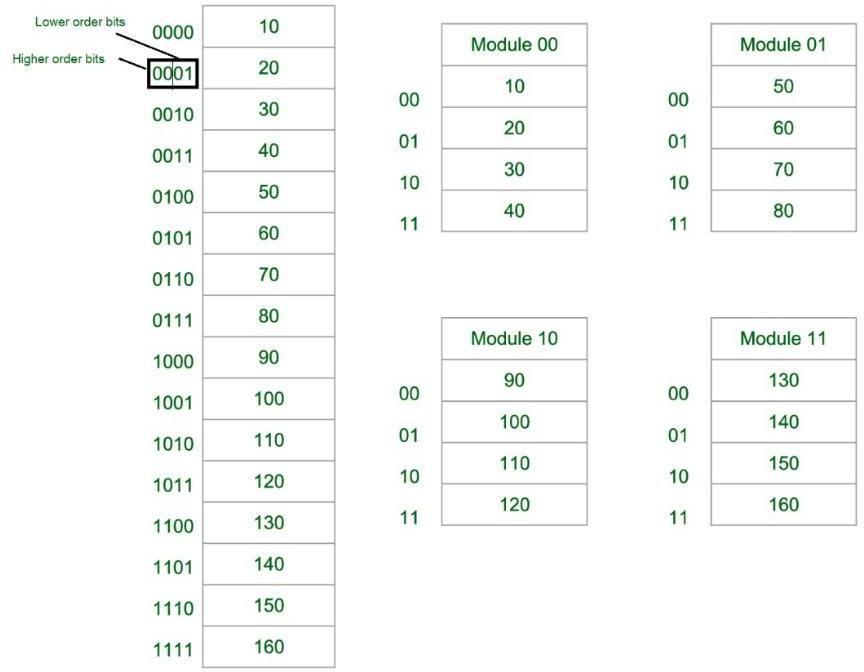{fig-align="center" width="85%"}

## High-Order Interleaving — How It Works

::: {.incremental}
- **MSBs** of the address select the memory chip (module)
- **LSBs** are sent as addresses within each chip
- Consecutive memory locations are accessed from the **same module**
- When a block of data is transferred to cache, **only one module** is involved
- Maximum data transfer rate is **limited by the memory cycle time**
:::

```
Address format (high-order):
┌──────────────────┬──────────────────────┐
│  Module Select   │  Address within      │
│  (high-order     │  module (low-order   │
│   k bits)        │   remaining bits)    │
└──────────────────┴──────────────────────┘
```

::: {.notes}
High-order interleaving partitions memory into contiguous blocks. Module 0 gets the first N/M addresses, Module 1 gets the next N/M addresses, and so on. This is like giving each module a "chapter" of the address space.
:::

## High-Order Interleaving — Applications

::: {.incremental}
- **Multi-programmed / multi-tasking systems** — each process or program can be assigned to a separate module, reducing contention between them
- **Fault isolation** — if one module fails, only data in that contiguous block is lost; other modules remain operational
- **Memory protection** — contiguous address blocks per module make it easier to enforce access boundaries between processes
- **Embedded systems** — where different memory regions (code, data, I/O) are mapped to physically separate chips
:::

::: {.notes}
High-order interleaving doesn't speed up sequential access, but it excels in scenarios where multiple independent entities (processes, devices) access different parts of memory simultaneously. Think of it as giving each tenant their own apartment (module) rather than sharing rooms.
:::

## Low-Order Interleaving

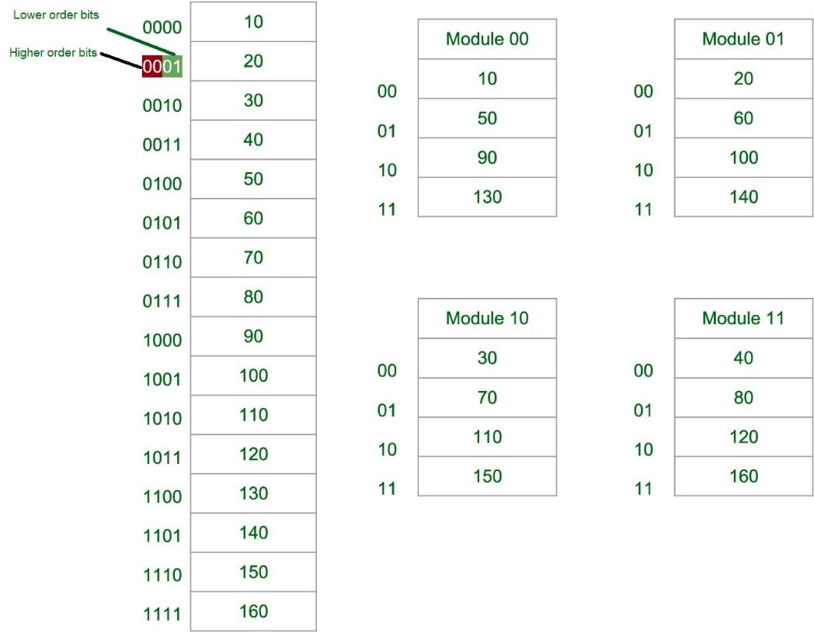{fig-align="center" width="85%"}

## Low-Order Interleaving — How It Works

::: {.incremental}
- **LSBs** of the address select the memory bank (module)
- Consecutive memory addresses are in **different memory modules**
- **Parallel access** is possible — hence, faster
- Allows memory access at rates **much faster** than the cycle time of a single module
- Results in **higher average utilization** of the memory system
:::

```
Address format (low-order):
┌──────────────────────┬──────────────────┐
│  Address within      │  Module Select   │
│  module (high-order  │  (low-order      │
│   remaining bits)    │   k bits)        │
└──────────────────────┴──────────────────┘
```

::: {.notes}
Low-order interleaving distributes consecutive addresses across modules in round-robin fashion. Word 0 in Module 0, Word 1 in Module 1, ..., Word M-1 in Module M-1, then Word M back in Module 0, etc. This is the scheme that enables true parallelism for sequential accesses.
:::

## Low-Order Interleaving — Applications

::: {.incremental}
- **Cache line fills** — when a cache miss occurs, an entire block of consecutive words must be fetched; low-order spreads these across modules for parallel retrieval
- **Pipelined processors** — sequential instruction fetches hit different modules, keeping the pipeline fed without stalls
- **Vector / array processing** — scientific workloads that sweep through large arrays sequentially benefit directly from overlapped access
- **Modern DRAM systems** — dual-channel and quad-channel memory configurations use low-order interleaving to maximize bandwidth
:::

::: {.notes}
Low-order interleaving is the dominant scheme in modern systems precisely because most memory access patterns have strong spatial locality — programs tend to access consecutive addresses. Cache line fills, instruction fetches, and array traversals all benefit enormously from spreading consecutive addresses across banks.
:::

## Why Low-Order Is Faster — Overlapped Access

With 4-way low-order interleaving and cycle time $T$:

```
         Time ──────────────────────────────────►

Module 0 │▓▓▓▓▓▓▓▓▓▓│          │▓▓▓▓▓▓▓▓▓▓│
Module 1 │  │▓▓▓▓▓▓▓▓▓▓│          │▓▓▓▓▓▓▓▓▓▓│
Module 2 │    │▓▓▓▓▓▓▓▓▓▓│          │▓▓▓▓▓▓▓▓▓▓│
Module 3 │      │▓▓▓▓▓▓▓▓▓▓│          │▓▓▓▓▓▓▓▓▓▓│

Output   │ W0  │ W1  │ W2  │ W3  │ W4  │ W5  │ W6  │ W7
```

- Each module still takes full cycle time $T$ to complete
- But a new word is delivered every $T/4$ time units
- **Effective bandwidth** = $4 \times$ single module bandwidth

::: {.notes}
This is the key insight of low-order interleaving. Even though each module is slow, by staggering the start times we get pipelined access. While Module 0 is busy, we start Module 1, then Module 2, etc. By the time we come back to Module 0, it has finished its previous access.
:::

## Comparison: High vs. Low Order

| Feature | High-Order | Low-Order |
|---|---|---|
| Module selection | MSBs | LSBs |
| Consecutive addresses | Same module | Different modules |
| Sequential access parallelism | No — one module at a time | Yes — overlapped across modules |
| Sequential access speed | Limited by cycle time $T$ | Effective rate $\approx T/M$ |
| Block transfer to cache | Single module | Spread across modules |
| Address distribution | Contiguous blocks | Round-robin / interleaved |
| Multi-program parallelism | Yes — different programs in different modules | Yes |

## Example: 4-Way Interleaving

Consider a memory system with **4 modules** ($k = 2$ bits for module select):

:::: {.columns}
::: {.column width="50%"}
### High-Order

| Module 0 | Module 1 | Module 2 | Module 3 |
|:---:|:---:|:---:|:---:|
| Addr 0 | Addr 4 | Addr 8 | Addr 12 |
| Addr 1 | Addr 5 | Addr 9 | Addr 13 |
| Addr 2 | Addr 6 | Addr 10 | Addr 14 |
| Addr 3 | Addr 7 | Addr 11 | Addr 15 |
:::

::: {.column width="50%"}
### Low-Order

| Module 0 | Module 1 | Module 2 | Module 3 |
|:---:|:---:|:---:|:---:|
| Addr 0 | Addr 1 | Addr 2 | Addr 3 |
| Addr 4 | Addr 5 | Addr 6 | Addr 7 |
| Addr 8 | Addr 9 | Addr 10 | Addr 11 |
| Addr 12 | Addr 13 | Addr 14 | Addr 15 |
:::
::::

## Worked Example: Locating Address $(1B)_{16}$

**Given:** 8 modules (M = 8, $k = 3$ bits), each with 4 words. Total = 32 words.

Address $(1B)_{16} = (00011011)_2 = 27_{10}$

. . .

:::: {.columns}
::: {.column width="50%"}
### High-Order

```
  00 011 011
  ── ─── ───
  │   │   └─ Word within module
  │   └───── (not used for select)
  └───────── Module = 00011 = 3
```

Module select = top 3 bits = **011** = Module 3

Word within module = 27 mod 4 = **3**

→ **Module 3, Word 3**
:::

::: {.column width="50%"}
### Low-Order

```
  00 011 011
  ── ─── ───
  │   │   └─ Module = 011 = 3
  │   └───── Word within module
  └─────────
```

Module select = bottom 3 bits = **011** = Module 3

Word within module = 27 div 8 = **3**

→ **Module 3, Word 3**
:::
::::

::: {.notes}
This is from the textbook example (Problem 6e). Both schemes happen to give the same module here, but the word placement within modules differs in general. Walk through a few more addresses to show the difference — e.g., addresses 0, 1, 2, 3 all go to Module 0 in high-order but to Modules 0, 1, 2, 3 in low-order.
:::

## Interleaving with DRAM

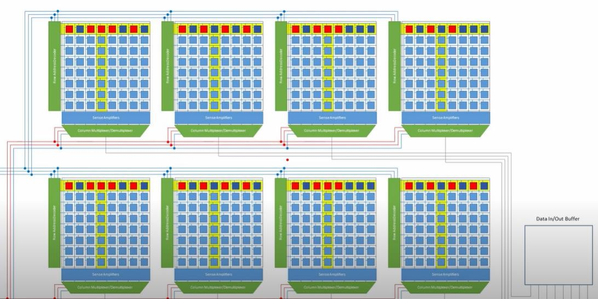{fig-align="center" width="85%"}

::: {.incremental}
- Main memory is usually composed of **DRAM chips** grouped into **memory banks**
- The memory banks are **interleaved** — accesses to different banks proceed **in parallel**
- Interleaved layouts give **far better performance** than contiguous allocation for sequential access
- Modern **multi-channel memory** (dual/quad channel) is an evolution of interleaving
:::

::: {.notes}
In practice, DRAM interleaving is one of the most important techniques for improving memory bandwidth. Modern systems use multi-channel memory configurations which are an evolution of the interleaving concept.
:::

# Memory Interface Address Map

## Address Map Concept

::: {.incremental}
- Designer must calculate **how much memory** is required and assign it to RAM or ROM
- Interconnection established from knowledge of memory size and available chip types
- A **memory address map** is a pictorial representation of assigned address space for each chip
:::

## Chip Count Formula

$$\text{Required chips} = p \times q, \quad p = \frac{N'}{N}, \quad q = \frac{W'}{W}$$

- $x$ = number of address bits per chip ($N = 2^x$)
- $y$ = number of bits for selecting among $p$ rows of chips ($p = 2^y$)
- $z$ = number of bits for selecting memory type (RAM vs. ROM vs. interface)
- **Total address bits** = $x + y + z$

# Cache Memory

## Cache Memory Principles

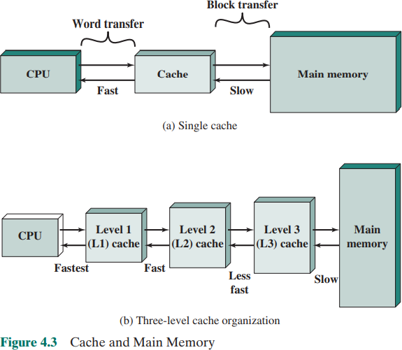{fig-align="center" width="85%"}

::: {.incremental}
- Special **very high-speed memory** used to speed up and synchronize with the CPU
- Acts as a **buffer between RAM and CPU**
- Holds **frequently requested data and instructions** for immediate availability
- Reduces the **average time** to access data from main memory
- Costlier than main memory but more economical than CPU registers
:::

## Types of Cache

- **Primary (L1) Cache** — built onto the processor chip, very fast (access time similar to registers), small size, uses SRAM
- **Secondary (L2) Cache** — external to L1, located between L1 and main memory

## Locality of Reference

::: {.theorem}
**Locality Principle.** Programs tend to access a relatively small portion of address space at any given time. We can predict future accesses based on recent past accesses.
:::

- **Temporal locality** — recently accessed items likely to be accessed again soon
- **Spatial locality** — items near recently accessed items likely to be accessed soon

## Locality of Reference — Visual

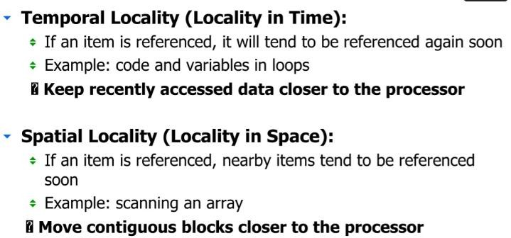{fig-align="center" width="85%"}

## Cache Mapping Techniques

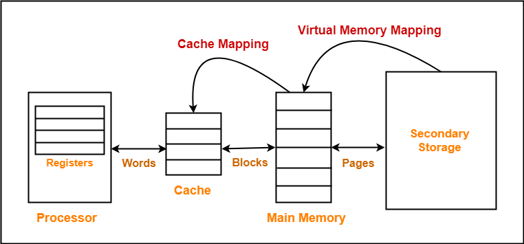{fig-align="center" width="85%"}

Three mapping strategies:

::: {.incremental}
1. **Direct mapping** — each memory block maps to exactly one cache line
   - Cache line = (MM Block Address) mod (Number of cache lines)
2. **Fully associative mapping** — a block can map to **any** cache line
   - Requires replacement algorithm (FIFO, LRU, Optimal)
3. **Set-associative mapping** — combination of direct and associative
   - Cache set = (MM Block Address) mod (Number of sets)
   - $k$-way: each set has $k$ lines
:::

## Direct Mapping — Address Format

```
┌───────────┬──────────────────┬──────────────┐
│   Tag      │  Line Number     │  Word Offset  │
│            │  (Index)         │              │
└───────────┴──────────────────┴──────────────┘
```

- PA bits = $N$ where MM size = $2^N$
- Block/line size = $2^Y$ → offset = $Y$ bits
- Number of cache lines → index bits
- Tag = remaining bits

## Associative Mapping — Address Format

```
┌─────────────────────────┬──────────────┐
│         Tag              │  Word Offset  │
│                          │              │
└─────────────────────────┴──────────────┘
```

- No index bits — any block can go to any line
- Larger tag → more comparison hardware needed

## Set-Associative Mapping — Address Format

```
┌───────────┬──────────────────┬──────────────┐
│   Tag      │  Set Number      │  Word Offset  │
│            │                  │              │
└───────────┴──────────────────┴──────────────┘
```

- $k = 1$ → direct mapping
- $k$ = total cache lines → fully associative

## Cache Miss Types

::: {.incremental}
- **Compulsory miss (cold miss)** — first access to a block; unavoidable
- **Conflict miss (collision miss)** — multiple blocks compete for the same cache line (direct and set-associative)
- **Capacity miss** — cache is too small to hold all needed blocks
:::

## Block Replacement Policies

Used in set-associative and fully associative caches:

::: {.incremental}
- **FIFO** — replace the block that has been in cache the longest
- **LRU (Least Recently Used)** — replace the block that has not been used for the longest time
- **Optimal** — replace the block that will not be used for the longest time in the future (theoretical)
:::

## Cache Update Policies

| Policy | Trigger | Action |
|---|---|---|
| **Write-through** | Write hit | Update cache **and** main memory simultaneously |
| **Write-back** | Write hit | Update cache now; update main memory on replacement |
| **Write-around** | Write miss | Update main memory only; do not load into cache |
| **Write-allocate** | Write miss | Update main memory **and** load block into cache |

## Mean Memory Access Time (MMAT)

::: {.definition}
**Look-Through Cache:** Cache is checked first; on miss, main memory is accessed.
$$T_{\text{avg}} = T_C + (1 - h) \times T_M$$
:::

::: {.definition}
**Look-Aside Cache:** Cache and main memory are accessed in parallel.
$$T_{\text{avg}} = h \times T_C + (1 - h) \times T_M$$
:::

Where $h$ = hit ratio, $T_C$ = cache access time, $T_M$ = main memory access time.

## MMAT Example

**Given:** $T_C = 20\text{ns}$, $T_M = 200\text{ns}$, $h = 0.9$

. . .

**Look-through:**

$$T_{\text{avg}} = 20 + (1 - 0.9) \times 200 = 20 + 20 = 40\text{ns}$$

. . .

**Look-aside:**

$$T_{\text{avg}} = 0.9 \times 20 + 0.1 \times 200 = 18 + 20 = 38\text{ns}$$
